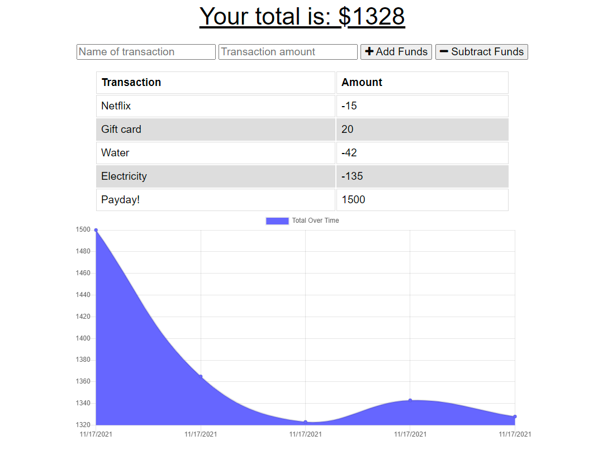

# pwa-budget-tracker

## Description

I've added some offline functionality to an app that let's the user track their budget, utilizing the [IndexdDB API](https://developer.mozilla.org/en-US/docs/Web/API/IndexedDB_API), a solution 'for client-side storage of significant amounts of structured data'. IndexedDB is the perfect solution for this app that saves transactions as objects to MongoDB, a similarly structured [NoSQL](https://en.wikipedia.org/wiki/NoSQL) database. The offline functionality ensures that no user input is lost if the connection of to the server is lost while the app is in use.

## Screenshot

## Link

[Link to deployment]()

## Featured Tech

* IndexedDB API
* MongoDB
* Mongoose
* Chart.js